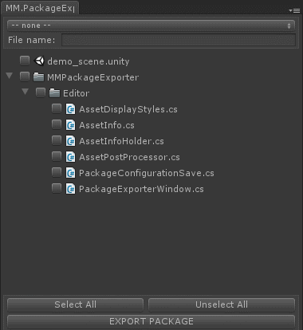

# Unity Package Exporter #

A custom Package Exporter for Unity3D that allows one to save and load package configurations.

Using the default Package Exporter provided by Unity asks one to re-select assets and content every time she wants to export a package. With this version one can save a configuration (list of files in a package) and re-load it anytime she wants.

Special thanks to [Demigiant](https://github.com/Demigiant) for his awesome help and knowledge on Unity3D Editor.